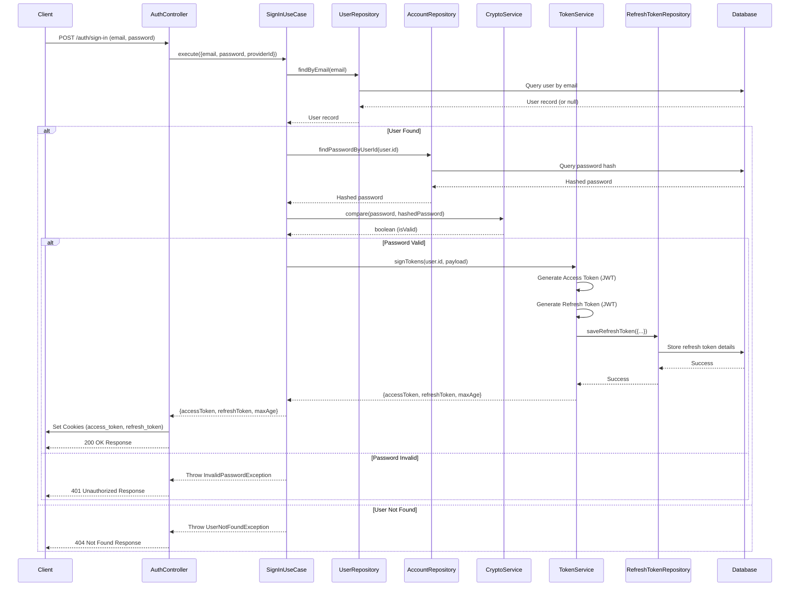
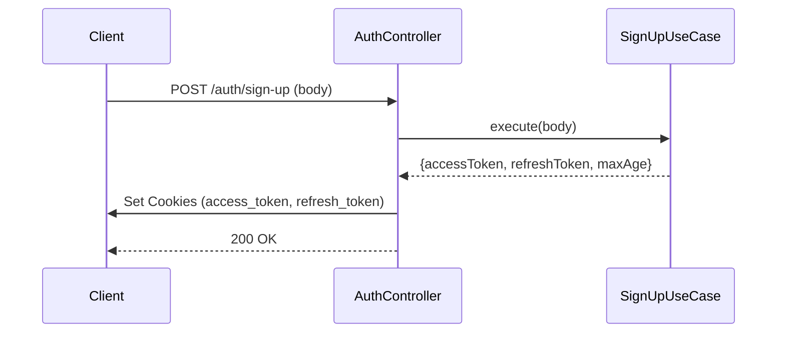
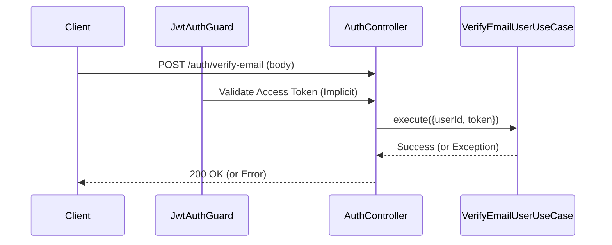
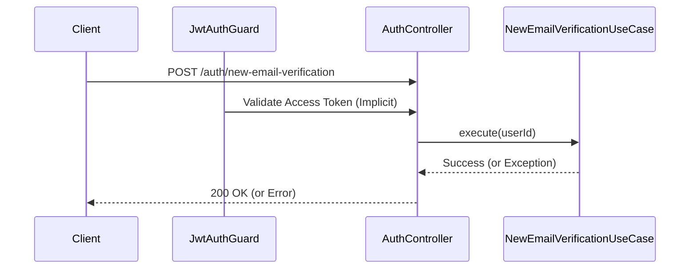
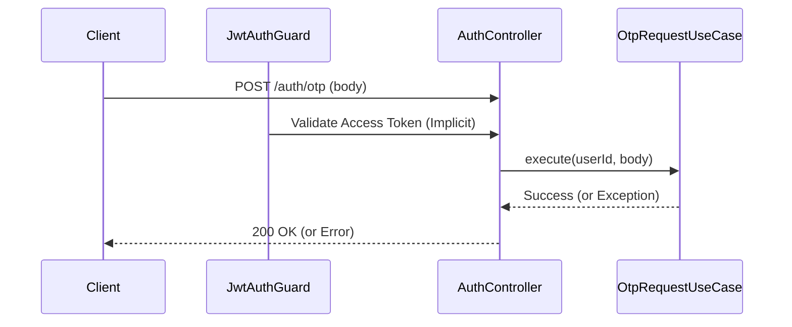
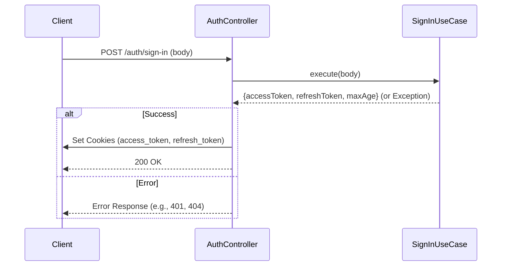
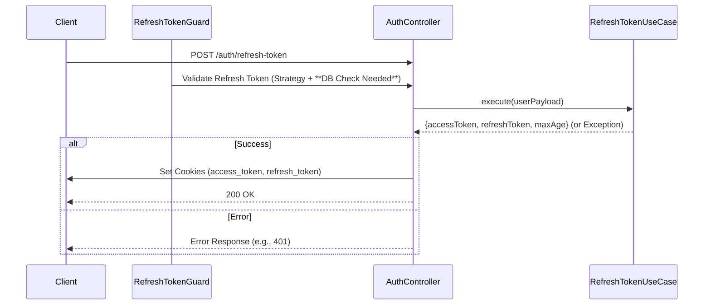

# Authentication Flow Security Design (`apps/api`)

This document outlines the design and security considerations of the authentication flow implemented in the `apps/api` NestJS application.

## Overview

The authentication system uses JSON Web Tokens (JWT) with an asymmetric RS256 signing algorithm. It employs a standard access token and refresh token pattern, delivered to the client via secure, HTTP-only cookies.

## Core Components

1.  **JWT Configuration (`HttpModule`):**
    *   Configured globally using `JwtModule.registerAsync`.
    *   Uses `EnvService` to load Base64 encoded `JWT_PRIVATE_KEY` and `JWT_PUBLIC_KEY` from environment variables.
    *   Specifies the `RS256` algorithm for signing and verification.

2.  **Token Service (`TokenService`):**
    *   Responsible for generating signed access and refresh JWTs using `JwtService`.
    *   Defines specific expiration times for access and refresh tokens.
    *   Saves refresh tokens to the database via `RefreshTokenRepository`, associating them with a user ID and expiry date.

3.  **Crypto Service (`CryptoService`):**
    *   Handles password hashing and comparison using `bcrypt`.
    *   Provides utility for generating cryptographically secure random strings (e.g., for OTPs).

4.  **Passport Strategies (`AccessTokenStrategy`, `RefreshTokenStrategy`):**
    *   Integrate with `passport-jwt` to handle token extraction and initial validation.
    *   `AccessTokenStrategy`: Extracts the access token from the `access_token` cookie, verifies the signature using the public key, checks expiration, and validates the payload structure using a Zod schema.
    *   `RefreshTokenStrategy`: Extracts the refresh token from the `refresh_token` cookie, verifies the signature using the public key, checks expiration (via JWT `exp` claim), and validates the payload structure using a Zod schema. **Crucially, it does not perform database validation itself.**

5.  **Guards (`JwtAuthGuard`, `RefreshTokenGuard`):**
    *   `JwtAuthGuard`: Registered globally (`APP_GUARD`), protects most endpoints by default. Relies on `AccessTokenStrategy` to validate incoming access tokens. Allows public access via the `@Public()` decorator.
    *   `RefreshTokenGuard`: Used specifically on endpoints requiring a valid refresh token (e.g., `/auth/refresh-token`). Relies on `RefreshTokenStrategy`. **Currently lacks the necessary database check for token validity/revocation.**

6.  **Controllers (`AuthController`):**
    *   Define authentication-related endpoints (sign-up, sign-in, verify-email, refresh-token, etc.).
    *   Use guards (`@UseGuards`) to protect endpoints.
    *   Delegate business logic to specific Use Cases.
    *   Set access and refresh tokens in HTTP-only cookies upon successful authentication/refresh.

7.  **Use Cases (`SignInUseCase`, `SignUpUseCase`, `RefreshTokenUseCase`, etc.):**
    *   Contain the core business logic for authentication flows.
    *   Interact with repositories (`UserRepository`, `AccountRepository`, `RefreshTokenRepository`) and services (`TokenService`, `CryptoService`).

8.  **Repositories (`RefreshTokenRepository`, etc.):**
    *   Provide an abstraction layer for database interactions related to authentication (e.g., saving/querying refresh tokens, fetching user passwords).

## Authentication Flow (Sign-In Example)

1.  User submits email/password to `/auth/sign-in`.
2.  `AuthController` receives the request.
3.  `SignInUseCase` is invoked:
    *   Finds user by email (`UserRepository`).
    *   Retrieves hashed password (`AccountRepository`).
    *   Compares submitted password with hash (`CryptoService.compare`).
    *   If valid, calls `TokenService.signTokens`.
4.  `TokenService`:
    *   Generates signed access and refresh JWTs with specific payloads and expiry times.
    *   Saves the refresh token details (token string, user ID, expiry, IP - *currently missing IP*) to the database (`RefreshTokenRepository`).
5.  `SignInUseCase` returns tokens and cookie `maxAge` to `AuthController`.
6.  `AuthController` sets `access_token` and `refresh_token` cookies (`HttpOnly`, `Secure` in production) and returns a success response.



## Token Validation Flow (Protected Endpoint)

1.  Client sends request to a protected endpoint with `access_token` cookie.
2.  Global `JwtAuthGuard` intercepts the request.
3.  `AccessTokenStrategy` is invoked:
    *   Extracts token from cookie.
    *   Verifies signature and expiration using the public key.
    *   Validates payload structure.
    *   Returns the validated user payload.
4.  `JwtAuthGuard` attaches the user payload to the request object (`req.user`).
5.  Request proceeds to the controller/route handler.

## Token Refresh Flow

1.  Client sends request to `/auth/refresh-token` with `refresh_token` cookie.
2.  `RefreshTokenGuard` intercepts the request.
3.  `RefreshTokenStrategy` is invoked:
    *   Extracts token from cookie.
    *   Verifies signature and expiration using the public key.
    *   Validates payload structure.
    *   Returns the validated payload *plus the raw token string*.
4.  `RefreshTokenGuard` receives the result. **(Missing Step: Should query DB here to check if token exists and is valid).**
5.  If strategy/guard passes, `RefreshTokenUseCase` is invoked:
    *   Calls `TokenService.signTokens` to generate *new* access and refresh tokens.
    *   Saves the *new* refresh token to the database.
    *   **(Missing Step: Should ideally invalidate the *old* refresh token in the database).**
6.  `AuthController` sets the new tokens in cookies.

## Security Findings & TODO List

The following items were identified during the security review and require attention:

*   [ ] **Critical:** Implement database validation in `RefreshTokenGuard` to check if the presented refresh token exists and is valid/not revoked before allowing token refresh.
*   [ ] Increase `bcrypt` cost factor in `CryptoService` from 8 to at least 10 (preferably 12+) and make it configurable via `EnvService`.
*   [ ] Review and significantly increase the lifetimes for access and refresh tokens in `TokenService` to practical values (e.g., Access: 15-60m, Refresh: 7-30d).
*   [ ] Ensure the cookie `maxAge` set in `AuthController` aligns with the actual refresh token lifetime.
*   [ ] Capture and store the user's IP address (`createdByIp`) when saving refresh tokens in `TokenService`.
*   [ ] Refactor `main.ts` and `auth.controller.ts` to use `EnvService` instead of direct `process.env` access.
*   [ ] If email verification is required before login, uncomment and verify the check in `SignInUseCase`.
*   [ ] Remove the `console.log(payload)` statement from `AccessTokenStrategy`.
*   [ ] Remove the default `expiresIn` option from the `JwtModule.registerAsync` configuration in `http.module.ts`.
*   [ ] Consider explicitly invalidating the *old* refresh token in the database during the token refresh flow (`RefreshTokenUseCase`).

## Simplified Controller Action Flows

These diagrams illustrate the high-level interaction for each endpoint in the `AuthController`.

### POST /auth/sign-up



### POST /auth/verify-email



### POST /auth/new-email-verification



### POST /auth/otp



### POST /auth/sign-in (Simplified)



### POST /auth/refresh-token



### POST /auth/forgot-password

```mermaid
sequenceDiagram
    participant Client
    participant RefreshGuard as RefreshTokenGuard
    participant AuthController
    participant ForgotPasswordUseCase

    Client->>AuthController: POST /auth/forgot-password (body)
    RefreshGuard->>AuthController: Validate Refresh Token (Strategy + **DB Check Needed**)
    AuthController->>ForgotPasswordUseCase: execute(userId, body)
    ForgotPasswordUseCase-->>AuthController: Success (or Exception)
    AuthController-->>Client: 200 OK (or Error)