# Backend Architecture Diagram (Mermaid)

```mermaid
flowchart TD
    subgraph Controllers
        A1[AuthController]
        A2[OrganizationsController]
        A3[MembershipsController]
        A4[MembershipInvitesController]
        A5[MembershipInvitesPublicController]
    end

    subgraph UseCases
        B1[SignUpUseCase]
        B2[SignInUseCase]
        B3[CreateOrganizationUseCase]
        B4[GetOrganizationUseCase]
        B5[UpdateOrganizationUseCase]
        B6[DeleteOrganizationUseCase]
        B7[GetMembershipUseCase]
        B8[ListMembershipsUseCase]
        B9[UpdateMembershipUseCase]
        B10[DeleteMembershipUseCase]
        B11[CreateMembershipInviteUseCase]
        B12[GetMembershipInviteUseCase]
        B13[GetMembershipInviteByTokenUseCase]
        B14[ListMembershipInvitesUseCase]
        B15[AcceptMembershipInviteUseCase]
        B16[DeleteMembershipInviteUseCase]
    end

    subgraph Services
        C1[VerificationService]
        C2[TokenService]
        C3[CryptoService]
        C4[EmailService]
        C5[OrganizationService]
        C6[MembershipService]
        C7[MembershipInviteService]
    end

    subgraph Events
        D1[SignedUpUserListener]
        D2[MembershipInviteListener]
        D3[MembershipInviteCreatedEvent]
        D4[MembershipInviteAcceptedEvent]
    end

    subgraph Repositories
        E1[UserRepository]
        E2[AccountRepository]
        E3[VerificationRepository]
        E4[ProviderRepository]
        E5[OrganizationRepository]
        E6[MembershipRepository]
        E7[MembershipInviteRepository]
    end

    %% Auth Controller Routes
    A1 --> B1
    A1 --> B2

    %% Organization Controller Routes
    A2 --> B3
    A2 --> B4
    A2 --> B5
    A2 --> B6

    %% Membership Controller Routes
    A3 --> B7
    A3 --> B8
    A3 --> B9
    A3 --> B10

    %% MembershipInvites Controller Routes
    A4 --> B11
    A4 --> B12
    A4 --> B14
    A4 --> B16

    %% MembershipInvitesPublic Controller Routes
    A5 --> B13
    A5 --> B15

    %% Auth Use Case Dependencies
    B1 --> C1
    B1 --> E1
    B1 --> E2
    B1 --> C3
    B1 --> D1

    B2 --> E1
    B2 --> C1
    B2 --> C3
    B2 --> C2
    B2 --> E2
    B2 --> E4

    %% Organization Use Case Dependencies
    B3 --> C5
    B4 --> C5
    B5 --> C5
    B6 --> C5

    %% Membership Use Case Dependencies
    B7 --> C6
    B8 --> C6
    B9 --> C6
    B10 --> C6

    %% MembershipInvite Use Case Dependencies
    B11 --> C7
    B11 --> D3
    B12 --> C7
    B13 --> C7
    B14 --> C7
    B15 --> C7
    B15 --> D4
    B16 --> C7

    %% Service Dependencies
    C1 --> E3
    C1 --> E1
    C5 --> E5
    C6 --> E6
    C7 --> E7
    C7 --> E6

    %% Event Handling
    D1 --> C4
    D2 --> C4
    D2 --> C5
    
    %% Event Emission
    B11 --> D3
    B15 --> D4
    
    %% Event Listeners
    D3 --> D2
    D4 --> D2
    
    %% Repository Dependencies
    E5 --> E6
    E7 --> E6
```

> This diagram shows the flow of dependencies between controllers, use cases, services, events, and repositories in the backend architecture. The architecture follows a clean approach with clear separation of concerns:
>
> 1. **Controllers** handle HTTP requests and delegate to use cases
> 2. **Use Cases** implement business logic and orchestrate operations
> 3. **Services** contain domain logic and reusable functionality
> 4. **Events** enable asynchronous communication and decoupling
> 5. **Repositories** abstract database access through Prisma
>
> The diagram has been expanded to include the organization, membership, and membership invite features, showing how these components interact with the existing authentication architecture. This architecture enables a scalable and maintainable system where each component has a single responsibility and dependencies flow in a controlled manner.

## Organization and Membership Architecture

The organization and membership system follows the same architectural patterns as the authentication system, with clean separations between layers:

1. **Controllers** define REST endpoints for:
   - Creating, reading, updating, and deleting organizations
   - Managing memberships (roles, removal)
   - Creating and managing membership invites
   - Accepting invites (public endpoint)

2. **Use Cases** implement specific business operations:
   - Organization management (create, get, update, delete)
   - Membership management (get, list, update, delete)
   - Invite management (create, get, list, delete, accept)

3. **Services** provide domain functionality:
   - OrganizationService for organization operations
   - MembershipService for membership operations
   - MembershipInviteService for invite lifecycle

4. **Repositories** handle data access:
   - OrganizationRepository extends BaseRepository
   - MembershipRepository extends BaseRepository
   - MembershipInviteRepository extends BaseRepository

5. **Events** enable decoupling:
   - MembershipInviteCreatedEvent when invites are created
   - MembershipInviteAcceptedEvent when invites are accepted
   - MembershipInviteListener for email notifications

This architecture ensures that each component has a clear responsibility, making the system more maintainable, testable, and scalable.