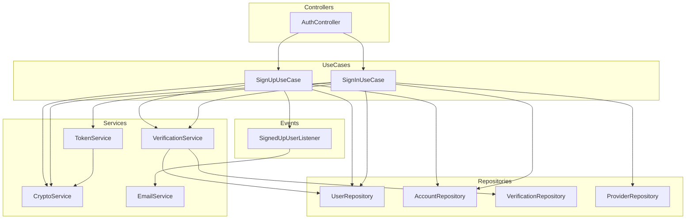

# Backend Architecture Diagram (Mermaid)

```mermaid
flowchart TD
    subgraph Controllers
        A1[AuthController]
    end

    subgraph UseCases
        B1[SignUpUseCase]
        B2[SignInUseCase]
    end

    subgraph Services
        C1[VerificationService]
        C2[TokenService]
        C3[CryptoService]
        C4[EmailService]
    end

    subgraph Events
        D1[SignedUpUserListener]
    end

    subgraph Repositories
        E1[UserRepository]
        E2[AccountRepository]
        E3[VerificationRepository]
        E4[ProviderRepository]
    end

    A1 --> B1
    A1 --> B2

    B1 --> C1
    B1 --> E1
    B1 --> E2
    B1 --> C3
    B1 --> D1

    B2 --> E1
    B2 --> C1
    B2 --> C3
    B2 --> C2
    B2 --> E2
    B2 --> E4

    C1 --> E3
    C1 --> E1
    D1 --> C4

    C2 --> C3
```

> This diagram shows the flow of dependencies between controllers, use cases, services, events, and repositories in the authentication architecture.