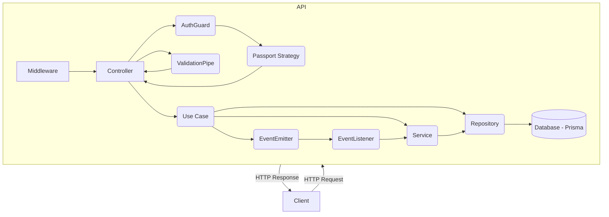
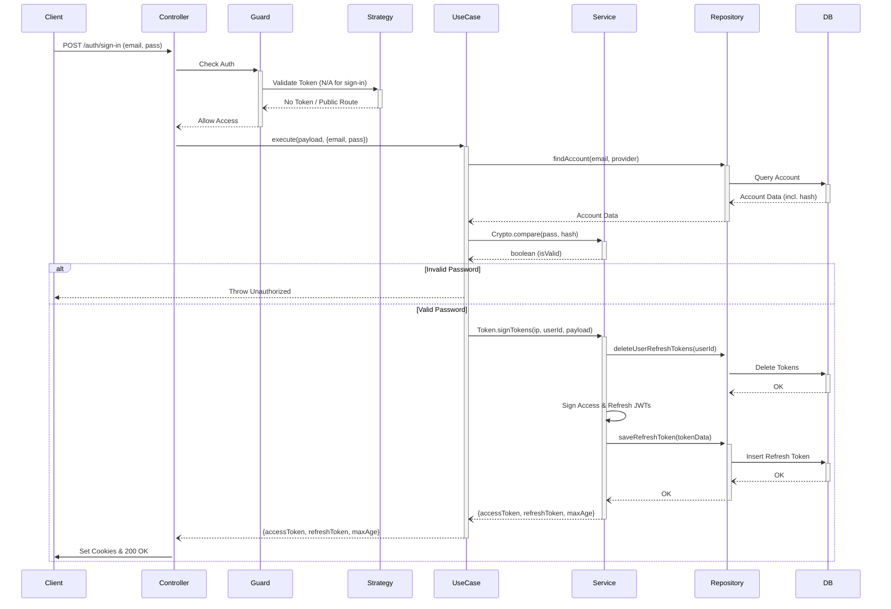
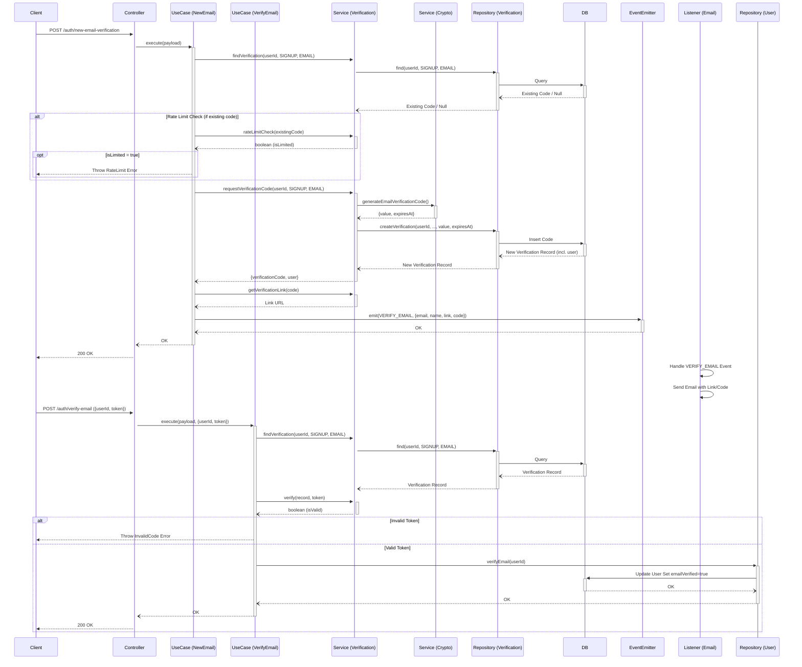

# Backend Architecture Documentation (apps/api)

This document outlines the architecture, design decisions, and implementation details of the `apps/api` backend service, focusing primarily on the authentication and core application flow.

## 1. Overview

The `apps/api` backend is built using the **NestJS framework**, leveraging its modular structure, dependency injection system, and integration with libraries like Passport for authentication. It interacts with a database via **Prisma ORM** and uses **Zod** for schema validation. The architecture aims for separation of concerns, dividing responsibilities across controllers, use cases (application/business logic), services (domain logic/utilities), and repositories (data access). Asynchronous tasks and decoupling are handled via NestJS's event emitter (`@nestjs/event-emitter`).

### 1.1. Core Technologies

*   **Framework:** NestJS (vX.Y.Z - *Specify version if known*)
*   **Language:** TypeScript
*   **Database ORM:** Prisma
*   **Authentication:** Passport.js (`passport-jwt`)
*   **Validation:** Zod
*   **Events:** `@nestjs/event-emitter`
*   **Cryptography:** `bcrypt` (Password Hashing), `node:crypto` (Code Generation), `jsonwebtoken` (via `@nestjs/jwt`)

### 1.2. High-Level Flow (Mermaid Diagram)



## 2. Authentication Flow

Authentication is primarily token-based using JWT (JSON Web Tokens) with an access token/refresh token strategy. Tokens are stored in secure, HTTP-only cookies.

### 2.1. Components

*   **`AuthController` (`http/controllers/auth.controller.ts`):** Defines public and protected endpoints for signup, signin, email verification, OTP requests, password reset, and token refresh. Uses Zod pipes for input validation and delegates logic to specific use cases. Passes request context (`RequestPayload`) to use cases.
*   **Use Cases (`use-cases/auth/`):** Encapsulate the business logic for each authentication action (e.g., `SignUpUseCase`, `SignInUseCase`, `RefreshTokenUseCase`, `ForgotPasswordUseCase`, `VerifyEmailUserUseCase`, etc.). Orchestrate calls to services and repositories.
*   **Services (`use-cases/auth/services/`):**
    *   **`TokenService`:** Handles JWT signing (access & refresh tokens), manages token expiry, invalidates old tokens, and persists refresh tokens to the database (including user IP).
    *   **`CryptoService`:** Handles password hashing/comparison (`bcrypt`) and secure generation of OTP/verification codes (`node:crypto`). Uses configurable salt rounds and code parameters.
    *   **`VerificationService`:** Manages the lifecycle of verification codes (requesting, storing, finding, verifying, deleting, rate limiting).
    *   **`AccountService`:** Handles account-specific logic like password updates (change/reset).
*   **Strategies (`http/strategies/`):**
    *   **`AccessTokenStrategy` (`access-token.strategy.ts`):** Validates incoming access tokens (`access_token` cookie) using `passport-jwt`. Verifies signature and expiry (e.g., 1 minute) using the configured JWT secret or public key. Extracts the token purely from the `access_token` cookie.
    *   **`RefreshTokenStrategy` (`refresh-token.strategy.ts`):** Validates incoming refresh tokens (`refresh_token` cookie) using `passport-jwt`. Verifies signature and expiry (e.g., 2 minutes) using the configured JWT secret or public key. Extracts the token purely from the `refresh_token` cookie and includes the request object for potential IP checks.
*   **Guards (`http/guards/`):**
    *   **`JwtAuthGuard` (`jwt-auth.guard.ts`):** Protects endpoints using the `AccessTokenStrategy`. Checks for `@Public()` decorator to allow access to public routes. Attaches the validated user payload (`JwtAccessTokenPayload`) to the request.
    *   **`RefreshTokenGuard` (`refresh-token.guard.ts`):** Protects the token refresh endpoint using the `RefreshTokenStrategy`. Attaches the validated refresh token payload (`JwtRefreshTokenPayload`) and the raw refresh token string to the request.
*   **Repositories (`database/repositories/`):** Abstract database interactions using Prisma (e.g., `UserRepository`, `AccountRepository`, `RefreshTokenRepository`, `VerificationRepository`).
*   **Decorators (`http/decorators/`):**
    *   `@Public()`: Marks routes that bypass authentication.
    *   `@Request()`: Custom decorator to inject `RequestPayload` (containing user details, IP, etc.) into controllers/use cases.
*   **Pipes (`http/pipes/`):**
    *   `ZodValidationPipe`: Validates request bodies against Zod schemas.
*   **Events (`events/auth/` & `@repo/domain`):** Define event payloads (e.g., `SignedUpUserEvent`, `PasswordUpdatedEvent`) emitted by use cases and listened to by event listeners (e.g., for sending emails).

### 2.2. Authentication Process (Sign-In Example)

1.  Client sends POST `/auth/sign-in` with email, password, providerId.
2.  `AuthController.signin` receives the request.
3.  `ZodValidationPipe` validates the request body against `signInUserSchema`.
4.  `SignInUseCase.execute` is called with `RequestPayload` and validated body.
5.  `SignInUseCase` calls `AccountRepository.findAccountByUserEmailAndProvider`.
6.  If account found, `CryptoService.compare` verifies the password hash.
7.  If valid, `TokenService.signTokens` is called:
    *   `RefreshTokenRepository.deleteUserRefreshTokens` invalidates old tokens for the user.
    *   `JwtService` signs a new short-lived access token and a longer-lived refresh token.
    *   `RefreshTokenRepository.saveRefreshToken` persists the new refresh token (with user IP).
8.  `SignInUseCase` returns tokens and `maxAge` to `AuthController`.
9.  `AuthController` uses `setAuthCookies` to set `access_token` and `refresh_token` cookies in the `FastifyReply`.
10. `AuthController` sends a 200 OK response.

### 2.3. Token Refresh Process (Corrected Flow)

1.  Client sends POST `/auth/refresh-token` (typically when an API request fails due to an expired access token). The `refresh_token` cookie must be present.
2.  The `/auth/refresh-token` route is specifically protected by the `RefreshTokenGuard`.
3.  `RefreshTokenGuard` invokes the `RefreshTokenStrategy`.
4.  `RefreshTokenStrategy` extracts the `refresh_token` from the cookies.
5.  `passport-jwt` within the strategy validates the refresh token's signature and expiry against the configured secret/key and options (e.g., 2 min expiry).
6.  If the token is cryptographically valid, `RefreshTokenStrategy.validate` returns the token payload (e.g., `{ sub: userId, jti: tokenId }`).
7.  `RefreshTokenGuard` attaches the validated payload (`request.user`) and the raw token (`request.refreshToken`) to the request object and allows access to the controller.
8.  `AuthController.refreshToken` is called. It extracts the user ID (`sub`) and token ID (`jti`) from `request.user` and the raw token from `request.refreshToken`.
9.  `RefreshTokenUseCase.execute` is called with the user ID, token ID, raw token, and `RequestPayload`.
10. `RefreshTokenUseCase` performs necessary business logic checks:
    *   Calls `RefreshTokenRepository.findTokenById` to ensure the token exists in the database and hasn't been revoked/invalidated.
    *   Compares the raw token from the request with the stored token hash/value (if applicable, depending on storage strategy).
    *   Checks user status (e.g., active).
11. If all checks pass, `TokenService.signTokens` is called to issue a new pair of access (1 min) and refresh (2 min) tokens. This typically involves invalidating the *used* refresh token in the database (`RefreshTokenRepository.delete`) and saving the *new* one (`RefreshTokenRepository.saveRefreshToken`).
12. `AuthController` receives the new tokens and `maxAge`, sets the new `access_token` and `refresh_token` cookies, and sends a 200 OK response.

### 2.4. Design Decisions & Rationale

*   **NestJS Modularity:** Leverages NestJS modules for organizing features (Auth, Users, Organizations, etc.). *Rationale: Promotes separation of concerns, maintainability, and testability.*
*   **Use Case Driven Logic:** Centralizes business logic within dedicated use case classes. *Rationale: Keeps controllers thin, separates application logic from framework concerns, improves testability.*
*   **Repository Pattern:** Abstracts data access logic behind repository interfaces/classes. *Rationale: Decouples business logic from data storage details (Prisma), allows easier mocking for tests.*
*   **Service Layer:** Extracts reusable domain logic and utilities (crypto, token generation, verification) into services. *Rationale: Promotes DRY, improves testability.*
*   **JWT (RS256) & Cookies:** Uses asymmetric JWTs stored in HttpOnly, Secure cookies. *Rationale: Stateless authentication, prevents token access via client-side scripts (XSS mitigation), asymmetric keys allow verification without exposing the private signing key.*
*   **Refresh Token Rotation & Invalidation:** Invalidates old refresh tokens and issues new ones on each refresh/login. Stores refresh tokens in DB. *Rationale: Enhances security by limiting the lifespan of refresh tokens and allowing server-side revocation.*
*   **Event-Driven Notifications:** Uses event emitter for actions like sending verification/welcome emails. *Rationale: Decouples primary action (e.g., signup) from side effects (notifications), improving responsiveness and resilience.*
*   **Configuration (`EnvService`/`ConfigService`):** Uses NestJS config modules to manage environment variables. *Rationale: Centralized configuration, environment-specific settings.*
*   **Validation (Zod):** Uses Zod for robust request validation via pipes. *Rationale: Type-safe validation, clear schema definitions.*
*   **Custom Request Context (`RequestPayload`):** Encapsulates user, IP, etc., into a typed object passed down from the controller. *Rationale: Cleaner context propagation than passing raw request objects or multiple parameters.*

## 3. Organization, Membership, and Invites Flow

The application includes functionality for creating and managing organizations, memberships within those organizations, and the invitation process for new members.

### 3.1. Components

* **Controllers:**
  * **`OrganizationsController` (`http/controllers/organizations.controller.ts`):** Handles endpoints for creating, retrieving, updating, and deleting organizations.
  * **`MembershipsController` (`http/controllers/memberships.controller.ts`):** Manages organization memberships, including listing, retrieving, updating roles, and removing members.
  * **`MembershipInvitesController` (`http/controllers/membership-invites.controller.ts`):** Handles creating, listing, and retrieving membership invites for organizations.
  * **`MembershipInvitesPublicController`:** Provides endpoints for retrieving invites by token and accepting invites.

* **Use Cases:**
  * **Organization Use Cases:** `CreateOrganizationUseCase`, `GetOrganizationUseCase`, `UpdateOrganizationUseCase`, `DeleteOrganizationUseCase`
  * **Membership Use Cases:** `GetMembershipUseCase`, `ListMembershipsUseCase`, `UpdateMembershipUseCase`, `DeleteMembershipUseCase`
  * **Membership Invite Use Cases:** `CreateMembershipInviteUseCase`, `GetMembershipInviteUseCase`, `GetMembershipInviteByTokenUseCase`, `ListMembershipInvitesUseCase`, `AcceptMembershipInviteUseCase`, `DeleteMembershipInviteUseCase`

* **Services:**
  * **`OrganizationService`:** Manages organization data operations.
  * **`MembershipService`:** Handles membership-related logic, including role management.
  * **`MembershipInviteService`:** Manages the lifecycle of membership invites, including creation, retrieval, and acceptance.

* **Repositories:**
  * **`OrganizationRepository`:** Extends BaseRepository for organization data access.
  * **`MembershipRepository`:** Extends BaseRepository for membership data access.
  * **`MembershipInviteRepository`:** Extends BaseRepository for invite data access.

* **Event Handling:**
  * **`MembershipInviteCreatedEvent`:** Emitted when an invite is created.
  * **`MembershipInviteAcceptedEvent`:** Emitted when an invite is accepted.
  * **`MembershipInviteListener`:** Listens for invite events to send email notifications.

### 3.2. Organization and Membership Flow (Example)

1. **Creating an Organization:**
   * User sends POST to `/organizations` with organization details.
   * `OrganizationsController` validates input and calls `CreateOrganizationUseCase`.
   * Organization is created in the database.
   * A membership record for the creator is automatically created with OWNER role.

2. **Inviting a Member:**
   * Organization owner/admin sends POST to `/organizations/:organizationId/membership-invites`.
   * `MembershipInvitesController` validates the request and calls `CreateMembershipInviteUseCase`.
   * System checks that the user has appropriate permissions (admin/owner role).
   * An invite record is created with a unique token and expiration date.
   * `MembershipInviteCreatedEvent` is emitted.
   * `MembershipInviteListener` sends an email with the invitation link.

3. **Accepting an Invite:**
   * Invited user clicks the link and sends POST to `/membership-invites/accept/:token`.
   * `MembershipInvitesPublicController` calls `AcceptMembershipInviteUseCase`.
   * System validates that the token exists, hasn't expired, and hasn't been used.
   * A new membership record is created for the user.
   * The invite is marked as accepted with a timestamp.
   * `MembershipInviteAcceptedEvent` is emitted.
   * Notification is sent to the organization admin who created the invite.

4. **Managing Memberships:**
   * Organization admin can list members via GET to `/organizations/:organizationId/memberships`.
   * Admin can update a member's role via PATCH to `/organizations/:organizationId/memberships/:membershipId`.
   * Admin can remove a member via DELETE to `/organizations/:organizationId/memberships/:membershipId`.

### 3.3. Design Decisions & Rationale

* **Role-Based Permission Model:**
  * Organizations have members with specific roles (OWNER, ADMIN, USER).
  * Only users with OWNER or ADMIN roles can create invites and manage memberships.
  * This enforces proper access control within organizations.

* **Token-Based Invitations:**
  * Unique tokens ensure secure invitation links.
  * Tokens have expiration dates to limit the validity period.
  * Invites track acceptance status for auditability.

* **Event-Driven Notifications:**
  * Events for invite creation and acceptance decouple the invite process from notification sending.
  * This improves system responsiveness and resilience.

* **Repository Pattern:**
  * Consistent with authentication architecture, all data access goes through repositories.
  * Allows for centralized data access patterns and easier testing.

## 4. Areas for Improvement / TODO List

Based on the latest code review and recent fixes, the following areas require attention:

*   **[HIGH] Transactionality:**
    *   Implement atomic database transactions (`$transaction`) in:
        *   `SignUpUseCase` (User + Account creation).
        *   `VerifyEmailUserUseCase` (Verify code + Update user + Delete code).
        *   `ForgotPasswordUseCase` (Verify code + Reset password + Delete code).
        *   `ChangePasswordUseCase` (Verify code + Change password + Delete code).
        *   `VerificationService.requestVerificationCode` (if delete-before-create is desired, wrap delete+create).
        *   `AcceptMembershipInviteUseCase` (Create membership + Update invite status).
*   **[HIGH] Verification Code Deletion:**
    *   Ensure verification codes/OTPs are deleted immediately after successful use in `VerifyEmailUserUseCase`, `ForgotPasswordUseCase`, and `ChangePasswordUseCase` (within the transaction).
*   **[MEDIUM] `ChangePasswordUseCase` Logic:**
    *   Clarify OTP requirement. If needed, use a dedicated `VerificationAction` (e.g., `CHANGE_PASSWORD`).
    *   Check the return value of `verificationService.verify`.
    *   Implement robust account selection (find specific password account) instead of using `accounts[0]`.
*   **[MEDIUM] `ForgotPasswordUseCase` Logic:**
    *   Check the return value of `verificationService.verify`.
    *   Implement robust account selection instead of using `accounts[0]`.
*   **[MEDIUM] Idempotency Checks:**
    *   Add checks in `VerifyEmailUserUseCase` and `NewEmailVerificationUseCase` to prevent processing if the user is already verified.
*   **[LOW] Controller Response Handling:**
    *   Refactor `AuthController` to return data/DTOs instead of manipulating `FastifyReply` directly.
    *   Move cookie setting to a dedicated interceptor or response service.
*   **[LOW] JWT Configuration:**
    *   Centralize JWT options (public key, algorithm, potentially expiry) in `JwtModule.registerAsync` instead of injecting `EnvService` into strategies.
*   **[LOW] Cookie `maxAge`:**
    *   Align the `maxAge` returned by `TokenService` (and used by the controller/interceptor) with the actual refresh token expiration time configured via `EnvService`.
*   **[LOW] Code Hygiene:**
    *   Remove remaining `console.log` statements (e.g., `AccessTokenStrategy`).
*   **[MEDIUM] Organization/Membership Controller Improvements:**
    *   Ensure all controller methods consistently capture the `organizationId` parameter from the URL.
    *   Add proper authorization checks based on organization membership and roles.
    *   Consider adding transaction support for critical operations like member removal.
*   **[LOW] Type Improvements:**
    *   Create proper types for all parameters, especially `ListMembershipInvitesParams`.
    *   Ensure consistent handling of enum types, such as `PrismaRoles`.

## 5. Potential Future Enhancements

*   **OAuth Integration:** Add strategies and use cases for social logins (Google, GitHub, etc.).
*   **Two-Factor Authentication (2FA):** Implement 2FA using TOTP apps or SMS/Email OTPs during login.
*   **Role-Based Access Control (RBAC):** Enhance guards (`PoliciesGuard` seems to exist but wasn't reviewed) to handle fine-grained permissions based on user roles or abilities (e.g., using CASL).
*   **Advanced Rate Limiting:** Implement more sophisticated rate limiting (e.g., `@nestjs/throttler`) potentially with different limits for different actions or based on user tiers.
*   **Audit Logging:** Implement comprehensive audit trails for sensitive actions (login attempts, password changes, email changes, etc.).
*   **Session Management:** Explore server-side session management options if more complex state or immediate revocation beyond refresh token DB checks is needed.
*   **API Documentation:** Integrate Swagger/OpenAPI documentation generation.
*   **Organization Permissions System:** Implement more granular permissions within organizations beyond just roles.
*   **Nested Organization Teams/Groups:** Allow for teams or groups within organizations with their own permission sets.
*   **Invite Management Dashboard:** Build admin features for tracking and managing outstanding invitations.
*   **Organization Activity Feed:** Implement an activity log for organization events (member joins, role changes, etc.).

## 6. Diagrams

### 6.1. Authentication Flow (Simplified)



### 6.2. Token Refresh Flow (Corrected)

```mermaid
sequenceDiagram
    participant Client
    participant Controller
    participant Guard (Refresh)
    participant Strategy (Refresh)
    participant UseCase (Refresh)
    participant Service (Token)
    participant Repository (Refresh)
    participant DB

    Client->>+Controller: POST /auth/refresh-token (with refresh_token cookie)
    Controller->>+Guard (Refresh): Check Auth (Uses RefreshTokenStrategy)
    Guard (Refresh)->>+Strategy (Refresh): validate(payload from cookie)
    Strategy (Refresh)->>Strategy (Refresh): Verify JWT Signature & Expiry (e.g., 2 min)
    alt Invalid Token (Expired/Signature)
        Strategy (Refresh)--)-Guard (Refresh): Error
        Guard (Refresh)-->>Client: Throw Unauthorized
    else Valid Token
        Strategy (Refresh)--)-Guard (Refresh): Validated Payload {sub, jti}
        Guard (Refresh)--)-Controller: Allow Access, Attach user={sub, jti}, refreshToken=rawToken
        Controller->>+UseCase (Refresh): execute(sub, jti, rawToken, requestPayload)
        UseCase (Refresh)->>+Repository (Refresh): findTokenById(jti)
        Repository (Refresh)->>+DB: Query Refresh Token by ID
        DB--)-Repository (Refresh): Token Data / Null
        alt Token Not Found or Invalidated
            Repository (Refresh)--)-UseCase (Refresh): Null / Invalid
            UseCase (Refresh)-->>Client: Throw Unauthorized
        else Token Found & Valid
            Repository (Refresh)--)-UseCase (Refresh): Token Data
            UseCase (Refresh)->>+Service (Token): signTokens(ip, sub, payload)
            Service (Token)->>+Repository (Refresh): delete(jti)  # Invalidate used token
            Repository (Refresh)->>+DB: Delete Token
            DB--)-Repository (Refresh): OK
            Service (Token)->>Service (Token): Sign New Access (1min) & Refresh (2min) JWTs
            Service (Token)->>+Repository (Refresh): saveRefreshToken(new token data)
            Repository (Refresh)->>+DB: Insert New Refresh Token
            DB--)-Repository (Refresh): OK
            Repository (Refresh)--)-Service (Token): OK
            Service (Token)--)-UseCase (Refresh): {accessToken, refreshToken, maxAge}
            UseCase (Refresh)--)-Controller: {accessToken, refreshToken, maxAge}
            Controller->>Client: Set New Cookies & 200 OK
        end
    end
```

### 6.3. Verification Code Flow (Request & Verify Email)



### 6.4. Organization and Membership Flow

```mermaid
sequenceDiagram
    participant Client
    participant OrgController
    participant InviteController
    participant OrgUseCase
    participant InviteUseCase
    participant OrgService
    participant InviteService
    participant Repository
    participant EventEmitter
    participant EmailListener
    participant DB

    Client->>+OrgController: POST /organizations (name, description)
    OrgController->>+OrgUseCase: CreateOrganization.execute(userId, data)
    OrgUseCase->>+OrgService: createOrganization(data)
    OrgService->>+Repository: create(organization + ownership membership)
    Repository->>+DB: Transaction (Create Org + Membership)
    DB--)-Repository: New Organization with Membership
    Repository--)-OrgService: Organization Data
    OrgService--)-OrgUseCase: Organization Data
    OrgUseCase--)-OrgController: Organization Data
    OrgController->>Client: 201 Created (Organization)

    Client->>+InviteController: POST /orgs/:id/membership-invites (email, role)
    InviteController->>+InviteUseCase: CreateInvite.execute(userId, orgId, data)
    InviteUseCase->>+OrgService: checkUserPermissions(userId, orgId)
    OrgService->>+Repository: findMembership(userId, orgId)
    Repository->>+DB: Query Membership
    DB--)-Repository: Membership (with role)
    Repository--)-OrgService: Membership Data
    OrgService--)-InviteUseCase: isAuthorized
    InviteUseCase->>+InviteService: createMembershipInvite(orgId, userId, data)
    InviteService->>+Repository: create(invite with token)
    Repository->>+DB: Insert Invite
    DB--)-Repository: New Invite
    Repository--)-InviteService: Invite Data
    InviteService--)-InviteUseCase: Invite Data
    InviteUseCase->>+EventEmitter: emit(INVITE_CREATED, invite)
    EventEmitter--)-InviteUseCase: OK
    InviteUseCase--)-InviteController: Invite Data
    InviteController->>Client: 201 Created (Invite)

    EmailListener->>EmailListener: Handle INVITE_CREATED Event
    EmailListener->>EmailListener: Send Invitation Email

    Client->>+InviteController: POST /membership-invites/accept/:token
    InviteController->>+InviteUseCase: AcceptInvite.execute(token, userId)
    InviteUseCase->>+InviteService: acceptMembershipInvite(token, userId)
    InviteService->>+Repository: findInviteByToken(token)
    Repository->>+DB: Query Invite
    DB--)-Repository: Invite Data
    Repository--)-InviteService: Invite Data
    InviteService->>+Repository: transaction(createMembership + updateInvite)
    Repository->>+DB: Transaction
    DB--)-Repository: Updated Data
    Repository--)-InviteService: Updated Data
    InviteService--)-InviteUseCase: Result
    InviteUseCase->>+EventEmitter: emit(INVITE_ACCEPTED, invite, userId)
    EventEmitter--)-InviteUseCase: OK
    InviteUseCase--)-InviteController: Result
    InviteController->>Client: 200 OK

    EmailListener->>EmailListener: Handle INVITE_ACCEPTED Event
    EmailListener->>EmailListener: Send Notification Email