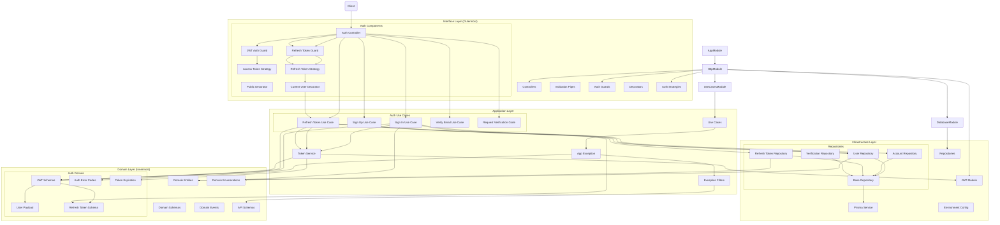

```mermaid
graph TD
    %% Core Layers
    subgraph "Domain Layer (Innermost)"
        E[Domain Entities]
        S[Domain Schemas]
        Enums[Domain Enumerations]
        Events[Domain Events]
        API[API Schemas]
        
        subgraph "Auth Domain"
            JWT[JWT Schemas]
            PayloadSchemas[User Payload]
            RefreshTokenSchemas[Refresh Token Schema]
            AuthErrorCodes[Auth Error Codes]
            ExpirationTimes[Token Expiration]
        end
    end

    %% Application Layer
    subgraph "Application Layer"
        UC[Use Cases]
        TokenService[Token Service]
        Exception[App Exception]
        Filters[Exception Filters]
        
        subgraph "Auth Use Cases"
            SignIn[Sign In Use Case]
            SignUp[Sign Up Use Case]
            RefreshToken[Refresh Token Use Case]
            VerifyEmail[Verify Email Use Case]
            RequestCode[Request Verification Code]
        end
    end

    %% Infrastructure Layer
    subgraph "Infrastructure Layer"
        Repos[Repositories]
        Prisma[Prisma Service]
        JWTModule[JWT Module]
        EnvService[Environment Config]
        
        subgraph "Repositories"
            UserRepo[User Repository]
            AccountRepo[Account Repository]
            RefreshTokenRepo[Refresh Token Repository]
            VerificationRepo[Verification Repository]
            BaseRepo[Base Repository]
        end
    end

    %% Interface Layer
    subgraph "Interface Layer (Outermost)"
        Ctrl[Controllers]
        Pipes[Validation Pipes]
        Guards[Auth Guards]
        Dec[Decorators]
        Strategies[Auth Strategies]
        
        subgraph "Auth Components"
            AuthController[Auth Controller]
            JwtAuthGuard[JWT Auth Guard]
            RefreshGuard[Refresh Token Guard]
            AccessStrategy[Access Token Strategy]
            RefreshStrategy[Refresh Token Strategy]
            PublicDec[Public Decorator]
            CurrentUserDec[Current User Decorator]
        end
    end

    %% Connections between components
    
    %% Domain to Application connections
    JWT --> PayloadSchemas
    JWT --> RefreshTokenSchemas
    
    %% Application to Domain connections
    SignIn --> JWT
    SignIn --> Enums
    RefreshToken --> RefreshTokenSchemas
    RefreshToken --> JWT
    TokenService --> JWT
    TokenService --> ExpirationTimes
    Exception --> AuthErrorCodes
    
    %% Application to Infrastructure connections
    SignIn --> UserRepo
    SignIn --> AccountRepo
    SignIn --> TokenService
    RefreshToken --> RefreshTokenRepo
    RefreshToken --> UserRepo
    RefreshToken --> TokenService
    
    %% Infrastructure to Domain connections
    UserRepo --> E
    RefreshTokenRepo --> E
    BaseRepo --> Prisma
    UserRepo --> BaseRepo
    AccountRepo --> BaseRepo
    RefreshTokenRepo --> BaseRepo
    VerificationRepo --> BaseRepo
    
    %% Interface to Application connections
    AuthController --> SignIn
    AuthController --> SignUp
    AuthController --> RefreshToken
    AuthController --> VerifyEmail
    AuthController --> RequestCode
    
    %% Interface layer inner connections
    JwtAuthGuard --> AccessStrategy
    RefreshGuard --> RefreshStrategy
    AuthController --> JwtAuthGuard
    AuthController --> RefreshGuard
    
    %% Auth Flow
    Client(Client) --> AuthController
    AuthController --> RefreshGuard
    RefreshGuard --> RefreshStrategy
    RefreshStrategy --> CurrentUserDec
    CurrentUserDec --> RefreshToken
    RefreshToken --> TokenService
    TokenService --> JWTModule
    
    %% Main module structure
    AppModule --> HttpModule
    HttpModule --> Ctrl
    HttpModule --> Guards
    HttpModule --> Strategies
    HttpModule --> JWTModule
    HttpModule --> DatabaseModule
    HttpModule --> UseCasesModule
    
    DatabaseModule --> Repos
    UseCasesModule --> UC
    UC --> Exception
    
    %% Error handling
    Exception --> Filters
    Filters --> API
```
