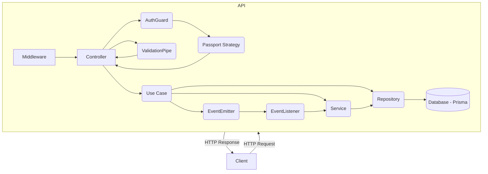
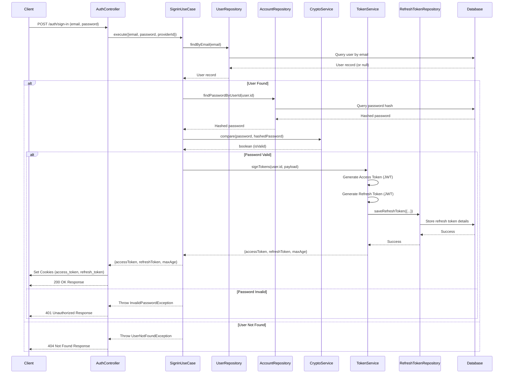
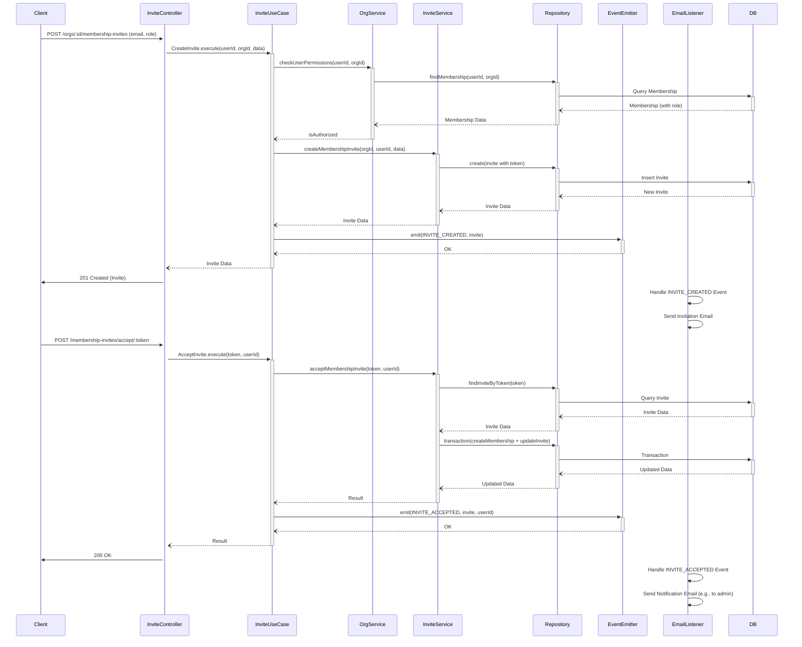

# Consolidated Backend Architecture (`apps/api`)

**Date:** 2025-04-13

**Context:** This document consolidates information from previous architecture documents (`auth.md`, `backend-architecture.md`, `backend.md`, `clean_architecture.md`, `project_scaling_review.md`) to provide a unified view of the `apps/api` backend service architecture, design decisions, and implementation details.

## 1. Introduction & Overview

The `apps/api` backend is the core API service for the SaaS platform, built using the **NestJS framework**. It follows a **Modular Monolith** architecture pattern, aiming for high cohesion within feature modules and clear separation of concerns between layers. The architecture adheres to principles inspired by Clean Architecture, dividing responsibilities across controllers, use cases, services, and repositories.

### 1.1. Core Technologies

*   **Framework:** NestJS
*   **Language:** TypeScript
*   **Database ORM:** Prisma
*   **Authentication:** Passport.js (`passport-jwt`)
*   **Validation:** Zod
*   **Events:** `@nestjs/event-emitter`
*   **Cryptography:** `bcrypt` (Password Hashing), `node:crypto` (Code Generation), `jsonwebtoken` (via `@nestjs/jwt`)

### 1.2. Architectural Philosophy

*   **Modular Monolith:** Organizes code into distinct `core` infrastructure modules and feature-specific `modules` to improve maintainability and scalability within a single deployable unit.
*   **Layered Approach:** Enforces a clear separation of concerns:
    *   **Interface Layer (Controllers, Guards, Strategies, Pipes):** Handles HTTP requests/responses, authentication/authorization checks, and input validation.
    *   **Application Layer (Use Cases):** Orchestrates business logic flows, coordinating services and repositories.
    *   **Domain Layer (Services, `packages/domain`):** Contains core domain logic, business rules, shared types, schemas, and entities.
    *   **Infrastructure Layer (Repositories, Prisma Service, External Service Integrations):** Handles data persistence, external API calls, and other infrastructure concerns.
*   **Dependency Rule:** Dependencies flow inwards (Interface -> Application -> Domain -> Infrastructure abstractions). Infrastructure implementations depend on abstractions defined in inner layers.

## 2. Core Architecture (`apps/api`)

The `apps/api` service implements the Modular Monolith pattern as described below.

### 2.1. Implemented Structure (`apps/api/src`)

```
apps/api/src/
├── core/                  # Core infrastructure, shared modules
│   ├── auth/              # Auth module (controllers, use-cases, services, strategies, guards, events, repositories...)
│   ├── database/          # Prisma service, BaseRepository
│   ├── email/             # Email service integration
│   ├── shared/            # Shared utilities/exceptions across all modules
│   └── core.module.ts     # Imports/exports core functionalities
├── modules/               # Feature/Domain Modules
│   ├── organization/      # Groups Organization, Membership, and Invite logic
│   │   ├── controllers/   # organization.controller, membership.controller, membership-invite.controller
│   │   ├── use-cases/     # create-organization, update-membership, accept-invite, etc.
│   │   ├── services/      # organization.service, membership.service, membership-invite.service
│   │   ├── repositories/  # organization.repository, membership.repository, membership-invite.repository
│   │   ├── events/        # Domain events & listeners specific to this module group
│   │   │   └── listeners/
│   │   └── organization.module.ts # Wires up this domain group
│   ├── billing/             # Future core SaaS module (Placeholder)
│   ├── notifications/       # Future core SaaS module (Placeholder)
│   ├── photography/         # Future specialized Module Example (Placeholder)
│   └── ...                  # Other future modules
├── app.module.ts          # Imports CoreModule and all feature Modules from modules/*
└── main.ts
```

*   **Rationale:** Promotes high cohesion (feature components live together), clear boundaries, and easier navigation within the monolith. Grouping related domains (Org, Membership, Invite) initially is pragmatic. DTOs are currently managed in `packages/domain`. Configuration is likely handled via `@nestjs/config` imported where needed.

### 2.2. High-Level Interaction Diagram



### 2.3. Key Components

*   **NestJS Modules:** Organize code into logical units (`CoreModule`, `AuthModule`, `OrganizationModule`, etc.) managing providers and controllers.
*   **Controllers:** Handle incoming HTTP requests, validate input using Pipes (Zod), apply Guards for auth, and delegate to Use Cases.
*   **Use Cases:** Encapsulate specific application workflows and business logic, orchestrating Services and Repositories.
*   **Services:** Contain reusable domain logic and interact with Repositories or other Services.
*   **Repositories:** Abstract data access using Prisma, providing methods for CRUD operations. Often extend a `BaseRepository`.
*   **Guards:** Implement authentication (`JwtAuthGuard`, `RefreshTokenGuard`) and authorization logic.
*   **Strategies:** Used by Passport.js to validate JWTs (`AccessTokenStrategy`, `RefreshTokenStrategy`).
*   **Pipes:** Perform request validation (`ZodValidationPipe`).
*   **Events/Listeners:** Decouple actions from side effects (e.g., sending emails on signup) using `@nestjs/event-emitter`.
*   **Configuration:** Managed via NestJS ConfigModule (`@nestjs/config`) and `EnvService`.
*   **Custom Decorators:** `@Public()` for public routes, `@Request()` for injecting request context.

## 3. Shared Domain (`packages/domain`)

This package centralizes shared code, primarily types and schemas, used across different parts of the application (potentially including frontend in the future).

### 3.1. Implemented Structure (`packages/domain/src`)

```
packages/domain/src/
├── auth/                  # Auth-related shared code
│   ├── dtos/              # Zod schemas for Auth API DTOs (*.dto.ts)
│   │   ├── index.ts
│   │   ├── sign-in-user.dto.ts
│   │   └── ...
│   ├── index.ts
│   ├── provider-types.enum.schema.ts # Enum schema
│   ├── role.enum.schema.ts           # Enum schema
│   └── ...                           # Other enums
├── entities/              # Zod schemas defining data structures (*.schema.ts)
│   ├── index.ts
│   ├── account.schema.ts
│   ├── membership.schema.ts
│   ├── organization.schema.ts
│   ├── user.schema.ts
│   └── ...
├── logging/               # Logging related code
│   ├── index.ts
│   └── error-codes.enum.ts # Enum
├── organization/          # Organization/Membership/Invite related shared code
│   ├── dtos/              # Zod schemas for Org/Memb/Invite API DTOs (*.dto.ts)
│   │   ├── index.ts
│   │   ├── create-organization.dto.ts
│   │   ├── update-membership.dto.ts
│   │   └── ...
│   └── index.ts
├── shared/                # General shared utilities/types
│   ├── index.ts
│   ├── request-params.ts
│   ├── request-query.ts
│   └── time-in-milliseconds.enum.ts # Enum
└── index.ts               # Main package export
```

*   **Structure:** Code is grouped primarily by domain (`auth/`, `organization/`, `logging/`).
*   **DTOs:** API Data Transfer Object Zod schemas (`*.dto.ts`) are located within `dtos/` subfolders inside their respective domain folders. These define the shape of data for API requests and responses.
*   **Entities:** Data structure definitions are Zod schemas (`*.schema.ts`) located in the top-level `entities/` folder. These represent the core data models.
*   **Enums:** Enumerations are located within the domain folders they relate to.

## 4. Authentication System

Authentication uses JWT with an access/refresh token strategy, delivered via secure, HTTP-only cookies. It employs RS256 asymmetric signing.

### 4.1. Core Components

*   **`AuthController`:** Defines endpoints (signup, signin, verify-email, refresh-token, etc.). Uses Zod pipes, guards, and delegates to Use Cases. Sets cookies.
*   **Auth Use Cases (`core/auth/use-cases/`):** `SignInUseCase`, `SignUpUseCase`, `RefreshTokenUseCase`, `VerifyEmailUserUseCase`, etc. Contain business logic.
*   **`TokenService` (`core/auth/services/`):** Generates signed access/refresh JWTs, manages expiry, saves/invalidates refresh tokens in DB (associating with user ID, expiry, IP).
*   **`CryptoService` (`core/auth/services/`):** Handles password hashing/comparison (`bcrypt`), generates secure codes.
*   **`VerificationService` (`core/auth/services/`):** Manages verification code lifecycle (request, store, verify, delete, rate limit).
*   **`AccountService` (`core/auth/services/`):** Handles account-specific logic (password updates).
*   **Strategies (`core/auth/strategies/`):**
    *   `AccessTokenStrategy`: Extracts/validates `access_token` cookie (signature, expiry).
    *   `RefreshTokenStrategy`: Extracts/validates `refresh_token` cookie (signature, expiry). **Requires DB check in guard.**
*   **Guards (`core/auth/guards/`):**
    *   `JwtAuthGuard`: Global guard using `AccessTokenStrategy`. Allows public via `@Public()`.
    *   `RefreshTokenGuard`: Protects refresh endpoint using `RefreshTokenStrategy`. **Needs DB check implementation.**
*   **Repositories (`core/auth/repositories/`):** `UserRepository`, `AccountRepository`, `RefreshTokenRepository`, `VerificationRepository`.
*   **Events (`core/auth/events/`):** `SignedUpUserEvent`, `PasswordUpdatedEvent`, etc.

### 4.2. Authentication Flow (Sign-In)



### 4.3. Token Refresh Flow (Corrected Logic)

```mermaid
sequenceDiagram
    participant Client
    participant AuthController
    participant Guard (Refresh)
    participant Strategy (Refresh)
    participant UseCase (Refresh)
    participant Service (Token)
    participant Repository (Refresh)
    participant DB

    Client->>+AuthController: POST /auth/refresh-token (with refresh_token cookie)
    Controller->>+Guard (Refresh): Check Auth (Uses RefreshTokenStrategy)
    Guard (Refresh)->>+Strategy (Refresh): validate(payload from cookie)
    Strategy (Refresh)->>Strategy (Refresh): Verify JWT Signature & Expiry
    alt Invalid Token (Expired/Signature)
        Strategy (Refresh)--)-Guard (Refresh): Error
        Guard (Refresh)-->>Client: Throw Unauthorized
    else Valid Token (Cryptographically)
        Strategy (Refresh)--)-Guard (Refresh): Validated Payload {sub, jti}
        %% --- CRITICAL DB CHECK (Missing in original Guard) ---
        Guard (Refresh)->>+Repository (Refresh): findTokenById(jti) # Check DB validity
        Repository (Refresh)->>+DB: Query Refresh Token by ID
        DB--)-Repository (Refresh): Token Data / Null
        alt Token Not Found or Invalidated in DB
             Repository (Refresh)--)-Guard (Refresh): Null / Invalid
             Guard (Refresh)-->>Client: Throw Unauthorized # Deny access
        else Token Found & Valid in DB
             Repository (Refresh)--)-Guard (Refresh): Token Data
             Guard (Refresh)--)-Controller: Allow Access, Attach user={sub, jti}, refreshToken=rawToken
             Controller->>+UseCase (Refresh): execute(sub, jti, rawToken, requestPayload)
             UseCase (Refresh)->>+Service (Token): signTokens(ip, sub, payload) # Issue NEW tokens
             Service (Token)->>+Repository (Refresh): delete(jti)  # Invalidate USED token
             Repository (Refresh)->>+DB: Delete Token
             DB--)-Repository (Refresh): OK
             Service (Token)->>Service (Token): Sign New Access & Refresh JWTs
             Service (Token)->>+Repository (Refresh): saveRefreshToken(new token data) # Save NEW token
             Repository (Refresh)->>+DB: Insert New Refresh Token
             DB--)-Repository (Refresh): OK
             Repository (Refresh)--)-Service (Token): OK
             Service (Token)--)-UseCase (Refresh): {accessToken, refreshToken, maxAge}
             UseCase (Refresh)--)-Controller: {accessToken, refreshToken, maxAge}
             Controller->>Client: Set New Cookies & 200 OK
         end
     end
 end
```

### 4.4. Authentication Security Considerations

*   **Refresh Token Validation:** The `RefreshTokenGuard` **must** perform a database check to ensure the presented refresh token exists and is valid before allowing the refresh flow to proceed.
*   **Token Lifetimes:** Access tokens should be short-lived (e.g., 15-60 minutes), while refresh tokens can be longer-lived (e.g., 7-30 days). These should be configurable.
*   **Refresh Token Rotation:** Issue a new refresh token and invalidate the old one upon successful refresh.
*   **`bcrypt` Cost Factor:** Use a sufficient cost factor (>=10, preferably 12+) for password hashing, configurable via environment variables.
*   **HttpOnly Cookies:** Use `HttpOnly`, `Secure` (in production), and potentially `SameSite` attributes for cookies to mitigate XSS and CSRF risks.
*   **IP Address Tracking:** Store the IP address associated with refresh tokens for potential security analysis.
*   **Rate Limiting:** Implement rate limiting on sensitive endpoints like login, OTP request, and password reset.

## 5. Organization, Membership & Invites

This feature set allows users to create/manage organizations and invite/manage members.

### 5.1. Core Components

*   **Controllers (`modules/organization/controllers/`):** `OrganizationsController`, `MembershipsController`, `MembershipInvitesController`, `MembershipInvitesPublicController`. Define REST endpoints.
*   **Use Cases (`modules/organization/use-cases/`):** Implement business logic for Org CRUD, Membership management (list, update role, delete), Invite management (create, list, accept, delete).
*   **Services (`modules/organization/services/`):** `OrganizationService`, `MembershipService`, `MembershipInviteService`. Contain domain logic.
*   **Repositories (`modules/organization/repositories/`):** `OrganizationRepository`, `MembershipRepository`, `MembershipInviteRepository`. Handle data access.
*   **Events/Listeners (`modules/organization/events/`):** `MembershipInviteCreatedEvent`, `MembershipInviteAcceptedEvent`, handled by `MembershipInviteListener` (e.g., for email notifications).

### 5.2. Key Flows

*   **Create Organization:** Creates an org record and automatically adds the creator as an OWNER member.
*   **Invite Member:** An OWNER/ADMIN creates an invite record with a unique, expiring token. An event triggers an email notification.
*   **Accept Invite:** User clicks link, system validates token, creates a membership record, marks invite as accepted, and triggers notification events.
*   **Manage Memberships:** Admins can list members, update roles, and remove members.

### 5.3. Design Decisions

*   **Role-Based Access Control (RBAC):** Uses roles (OWNER, ADMIN, USER) within organizations to control permissions for actions like inviting members or managing settings.
*   **Token-Based Invitations:** Secure, time-limited tokens for invites.
*   **Event-Driven Notifications:** Decouples invite actions from email sending.

### 5.4. Invite Flow Diagram



## 6. Design Decisions & Rationale (Consolidated)

*   **NestJS Modularity:** Promotes separation of concerns, maintainability, testability.
*   **Use Case Driven Logic:** Keeps controllers thin, separates application logic, improves testability.
*   **Repository Pattern:** Decouples business logic from data storage (Prisma), allows easier mocking.
*   **Service Layer:** Promotes DRY for reusable domain logic/utilities (crypto, token generation).
*   **JWT (RS256) & Cookies:** Stateless auth, XSS mitigation (HttpOnly), asymmetric keys enhance security.
*   **Refresh Token Rotation & DB Storage:** Enhances security via limited lifespan and server-side revocation capability.
*   **Event-Driven Notifications:** Decouples primary actions from side effects, improving responsiveness.
*   **Configuration (`EnvService`):** Centralized, environment-specific settings.
*   **Validation (Zod):** Type-safe validation, clear schemas.
*   **Custom Request Context (`RequestPayload`):** Cleaner context propagation.
*   **Role-Based Permissions (Organizations):** Enforces access control within organizations.
*   **Token-Based Invitations:** Secure, time-limited invite mechanism.

## 7. Areas for Improvement / TODO List (Consolidated)

*   **[CRITICAL] Refresh Token DB Validation:** Implement database check in `RefreshTokenGuard` before allowing refresh.
*   **[HIGH] Transactionality:** Implement atomic DB transactions (`$transaction`) in critical use cases (SignUp, VerifyEmail, ForgotPassword, ChangePassword, AcceptInvite, potentially VerificationService code request, Member Removal).
*   **[HIGH] Verification Code Deletion:** Ensure codes are deleted immediately after successful use within the transaction.
*   **[MEDIUM] `bcrypt` Cost Factor:** Increase cost factor (>=10) and make configurable.
*   **[MEDIUM] Token Lifetimes:** Review and set practical, configurable lifetimes for access/refresh tokens.
*   **[MEDIUM] `ChangePasswordUseCase` Logic:** Clarify OTP requirement, check verification result, implement robust account selection.
*   **[MEDIUM] `ForgotPasswordUseCase` Logic:** Check verification result, implement robust account selection.
*   **[MEDIUM] Idempotency Checks:** Prevent re-verification in `VerifyEmailUserUseCase`, `NewEmailVerificationUseCase`.
*   **[MEDIUM] Organization/Membership Authorization:** Add robust authorization checks based on roles for all relevant controller methods.
*   **[LOW] Controller Response Handling:** Refactor controllers to return DTOs, move cookie setting to interceptor/service.
*   **[LOW] JWT Configuration:** Centralize JWT options in `JwtModule.registerAsync`.
*   **[LOW] Cookie `maxAge`:** Align cookie `maxAge` with refresh token lifetime from config.
*   **[LOW] Code Hygiene:** Remove `console.log` statements.
*   **[LOW] Type Improvements:** Ensure consistent and specific types/enums are used (e.g., `ListMembershipInvitesParams`, `PrismaRoles`).
*   **[LOW] IP Address Storage:** Ensure IP is consistently captured for refresh tokens.
*   **[LOW] Env Variable Access:** Use `EnvService` consistently instead of `process.env`.

## 8. Potential Future Enhancements

*   OAuth Integration (Social Logins)
*   Two-Factor Authentication (2FA)
*   Enhanced RBAC/Permissions (e.g., CASL)
*   Advanced Rate Limiting (`@nestjs/throttler`)
*   Audit Logging
*   API Documentation (Swagger/OpenAPI)
*   Nested Organization Teams/Groups
*   Invite Management Dashboard
*   Organization Activity Feed

## 9. Diagrams

*(Relevant diagrams, like the Modular Monolith structure, Sign-In Flow, Refresh Flow, Invite Flow included above)*

*(Optional: Include Clean Architecture conceptual diagram if desired)*
```mermaid
graph TD
    subgraph "Interface Layer (Outermost)"
        Ctrl[Controllers]
        Pipes[Validation Pipes]
        Guards[Auth Guards]
        Strategies[Auth Strategies]
    end
    subgraph "Application Layer"
        UC[Use Cases]
    end
    subgraph "Domain Layer"
        Services[Domain Services]
        Entities[Entities / Schemas (@repo/domain)]
        Events[Domain Events]
    end
    subgraph "Infrastructure Layer (Innermost)"
        Repos[Repositories]
        DB[Database (Prisma)]
        Ext[External Services (Email)]
        Config[Configuration]
    end

    Ctrl --> UC
    Guards --> Strategies
    Pipes --> Ctrl
    UC --> Services
    UC --> Repos
    Services --> Repos
    Services --> Entities
    Repos --> DB
    Repos --> Entities
    Services --> Ext
    UC --> Events
    Events --> Listeners(App Layer/Infra)
    Listeners --> Services

    style Domain Layer fill:#D2E0FB,stroke:#333
    style Application Layer fill:#F9F3CC,stroke:#333
    style Interface Layer fill:#D5E8D4,stroke:#333
    style Infrastructure Layer fill:#FADBD8,stroke:#333