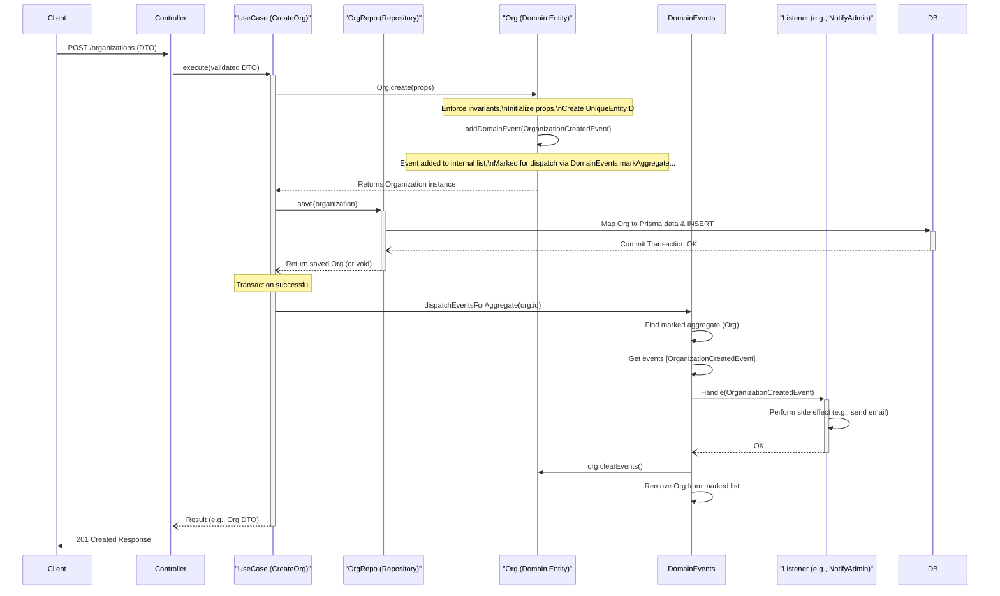
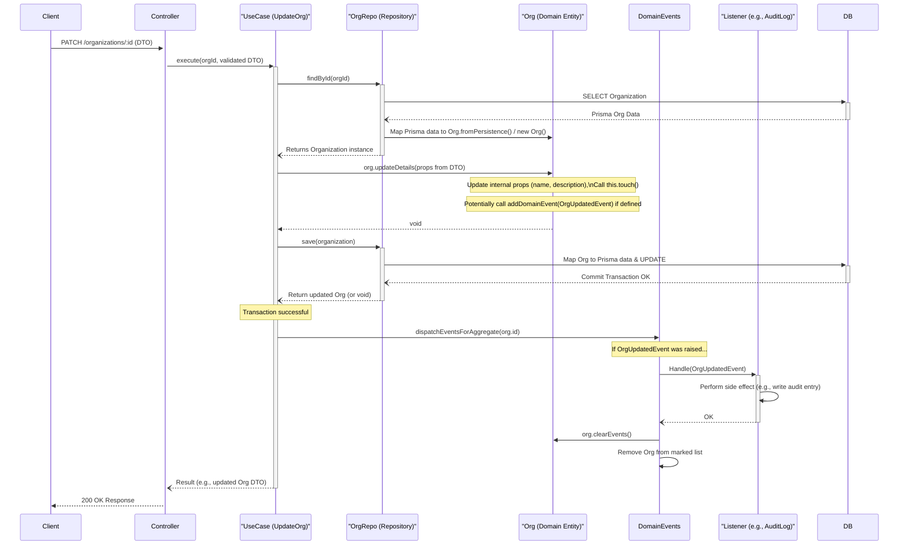

# Alternative Proposal: Rich Domain Entities (DDD Pattern)

**Date:** 2025-04-12

**Goal:** Detail an alternative approach for defining domain entities within `packages/domain` using richer TypeScript classes based on Domain-Driven Design (DDD) principles, including concepts like `Entity`, `AggregateRoot`, Value Objects, and Domain Events.

This approach contrasts with using simpler interfaces, plain classes, or Zod-inferred types for entities, offering stronger encapsulation and clearer domain modeling at the cost of some initial boilerplate.

## 1. Core Concepts

This pattern involves structuring the domain layer around specific building blocks:

*   **Entity:** An object defined primarily by its identity (ID) rather than its attributes. Entities have a lifecycle and their identity remains constant even if their attributes change. Often has a base class providing ID management and equality comparison.
*   **Value Object:** An object defined by its attributes, not identity. They are typically immutable. Examples: `Address`, `Money`, `EmailAddress`. Used to represent descriptive aspects of the domain.
*   **Aggregate:** A cluster of associated objects (Entities and Value Objects) treated as a single unit for data changes.
*   **Aggregate Root:** A specific entity within an Aggregate that acts as the entry point. All references from outside the aggregate must go through the Aggregate Root. Repositories typically load and save Aggregate Roots, ensuring the consistency of the entire aggregate.
*   **Domain Event:** Represents something significant that happened in the domain. Aggregate Roots often raise domain events when their state changes. These events can be dispatched (often after successful persistence) to trigger side effects or notify other parts of the system asynchronously.
*   **Repository:** Mediates between the domain and data mapping layers, providing an abstraction for accessing Aggregate Roots (e.g., `findOrganizationById`, `saveOrganization`). It handles mapping between domain objects (classes) and persistence formats (e.g., Prisma objects).

## 2. Domain Events vs. Application Events (`@nestjs/event-emitter`)

While both involve events, **Domain Events** (in DDD) differ conceptually from typical **Application Events**:

| Feature          | Domain Event (DDD Pattern)                     | Application Event (`@nestjs/event-emitter` typical use) |
| :--------------- | :--------------------------------------------- | :---------------------------------------------------- |
| **Source**       | Domain Model (Aggregate Root)                  | Application Layer (Use Case, Service)                 |
| **Meaning**      | Significant business state change occurred     | Action completed, side effect needed                  |
| **Raised By**    | Entity method (`addDomainEvent`)               | Explicit call (`eventEmitter.emit`)                   |
| **Dispatch Time**| Often delayed (post-transaction) via Dispatcher | Usually immediate                                     |
| **Primary Goal** | Decouple domain logic, notify other contexts   | Trigger side effects, intra-app communication         |

Domain Events originate *from within the domain model* when a significant state change occurs (e.g., `Organization.create()` raises `OrganizationCreatedEvent`). They are collected and typically dispatched *after* the database transaction succeeds, ensuring listeners react only to confirmed changes. This keeps the core domain logic clean and decoupled from side effects. Application events are often triggered directly by use cases/services to signal action completion or request side effects, usually dispatched immediately.

## 3. Proposed `packages/domain` Structure (DDD Focus)

```
packages/domain/src/
├── entities/              # Core domain entities (Classes extending Entity/AggregateRoot)
│   ├── index.ts
│   ├── organization.entity.ts # Example Aggregate Root class
│   ├── user.entity.ts         # Example Aggregate Root class
│   ├── membership.entity.ts   # Example Entity (part of Organization aggregate)
│   └── photography/
│       └── booking.entity.ts  # Example Aggregate Root class
├── value-objects/         # Reusable value objects
│   ├── index.ts
│   ├── address.vo.ts        # Example Value Object class
│   └── unique-entity-id.vo.ts # Value Object for IDs
├── enums/                 # Shared enums (remain largely the same)
│   ├── index.ts
│   └── role.enum.ts
├── events/                # Domain event definitions
│   ├── index.ts
│   ├── domain-event.interface.ts
│   ├── organization-created.event.ts # Example Domain Event class
│   └── membership-role-changed.event.ts
├── schemas/               # Zod schemas (Primarily for API DTO validation)
│   ├── index.ts
│   ├── api/                 # Schemas defining API request/response DTOs
│   │   ├── index.ts
│   │   ├── organizations/
│   │   │   └── create-organization.dto.schema.ts
│   │   └── ...
│   └── core/ / domain/      # Zod schemas for validating Value Objects or complex rules if needed
├── core/                  # Base classes/interfaces for DDD primitives
│   ├── entity.ts            # Base Entity class
│   ├── aggregate-root.ts    # Base AggregateRoot class (extends Entity)
│   └── domain-events.ts   # Static dispatcher logic or interface
└── index.ts               # Main package export
```

## 4. Example: `Organization` as an Aggregate Root

```typescript
// packages/domain/src/core/unique-entity-id.vo.ts
import { randomUUID } from 'node:crypto';

export class UniqueEntityID {
  private value: string;

  toString() {
    return this.value;
  }

  toValue() {
    return this.value;
  }

  constructor(value?: string) {
    this.value = value ?? randomUUID();
  }

  public equals(id: UniqueEntityID): boolean {
    if (id === null || id === undefined) {
      return false;
    }
    if (!(id instanceof UniqueEntityID)) {
        return false;
    }
    return id.toValue() === this.value;
  }
}

// packages/domain/src/core/entity.ts
import { UniqueEntityID } from './unique-entity-id.vo';

export abstract class Entity<Props> {
  protected readonly _id: UniqueEntityID;
  public readonly props: Props;

  get id(): UniqueEntityID {
    return this._id;
  }

  protected constructor(props: Props, id?: UniqueEntityID) {
    this._id = id ?? new UniqueEntityID();
    this.props = props;
  }

  public equals(object?: Entity<Props>): boolean {
    if (object === null || object === undefined) {
      return false;
    }
    if (this === object) {
      return true;
    }
    if (!(object instanceof Entity)) { // Use instanceof for type safety
      return false;
    }
    return this._id.equals(object._id);
  }
}

// packages/domain/src/core/domain-event.interface.ts
import { UniqueEntityID } from './unique-entity-id.vo';

export interface DomainEvent {
  occurredAt: Date;
  getAggregateId(): UniqueEntityID;
}

// packages/domain/src/core/domain-events.ts (Conceptual - Implementation varies)
// This is often a static class or service responsible for dispatching events
export class DomainEvents {
    private static handlersMap: any = {};
    private static markedAggregates: AggregateRoot<any>[] = [];

    public static markAggregateForDispatch(aggregate: AggregateRoot<any>): void {
        const aggregateFound = !!this.findMarkedAggregateByID(aggregate.id);
        if (!aggregateFound) {
            this.markedAggregates.push(aggregate);
        }
    }

    private static dispatchAggregateEvents(aggregate: AggregateRoot<any>): void {
        aggregate.domainEvents.forEach((event: DomainEvent) => this.dispatch(event));
    }

    // This method is typically called *after* a successful transaction
    public static dispatchEventsForAggregate(id: UniqueEntityID): void {
        const aggregate = this.findMarkedAggregateByID(id);
        if (aggregate) {
            this.dispatchAggregateEvents(aggregate);
            aggregate.clearEvents();
            this.removeAggregateFromMarked(aggregate);
        }
    }

    // Register handlers (listeners) for specific events
    public static register(callback: (event: DomainEvent) => void, eventClassName: string): void {
        const eventName = eventClassName; // Use class name as event name
        if (!this.handlersMap.hasOwnProperty(eventName)) {
            this.handlersMap[eventName] = [];
        }
        this.handlersMap[eventName].push(callback);
    }

    public static clearHandlers(): void {
        this.handlersMap = {};
    }

    public static clearMarkedAggregates(): void {
        this.markedAggregates = [];
    }

    // Dispatch a single event to its registered handlers
    private static dispatch(event: DomainEvent): void {
        const eventName: string = event.constructor.name;
        if (this.handlersMap.hasOwnProperty(eventName)) {
            const handlers: any[] = this.handlersMap[eventName];
            for (const handler of handlers) {
                handler(event); // Execute the handler callback
            }
        }
    }

     private static removeAggregateFromMarked(aggregate: AggregateRoot<any>): void {
        const index = this.markedAggregates.findIndex((a) => a.equals(aggregate));
        this.markedAggregates.splice(index, 1);
    }

    private static findMarkedAggregateByID(id: UniqueEntityID): AggregateRoot<any> | undefined {
        return this.markedAggregates.find((aggregate) => aggregate.id.equals(id));
    }
}


// packages/domain/src/core/aggregate-root.ts
import { Entity } from './entity';
import { DomainEvent } from './domain-event.interface';
import { DomainEvents } from './domain-events';
import { UniqueEntityID } from './unique-entity-id.vo';

export abstract class AggregateRoot<Props> extends Entity<Props> {
  private _domainEvents: DomainEvent[] = [];

  get id(): UniqueEntityID {
    return this._id;
  }

  get domainEvents(): DomainEvent[] {
    return this._domainEvents;
  }

  protected addDomainEvent(domainEvent: DomainEvent): void {
    this._domainEvents.push(domainEvent);
    // Mark this aggregate root for event dispatching
    DomainEvents.markAggregateForDispatch(this);
    // Log the event addition for debugging purposes if needed
    // this.logDomainEventAdded(domainEvent);
  }

  public clearEvents(): void {
    this._domainEvents = [];
  }

//   private logDomainEventAdded(domainEvent: DomainEvent): void {
//     const thisClass = Reflect.getPrototypeOf(this);
//     const domainEventClass = Reflect.getPrototypeOf(domainEvent);
//     console.info(`[Domain Event Created]:`, thisClass?.constructor.name, '==>', domainEventClass?.constructor.name)
//   }
}


// packages/domain/src/events/organization-created.event.ts
import { UniqueEntityID } from '../core/unique-entity-id.vo';
import { DomainEvent } from '../core/domain-event.interface';
import { Organization } from '../entities/organization.entity'; // Assuming Organization entity exists

export class OrganizationCreatedEvent implements DomainEvent {
  public occurredAt: Date;
  public organization: Organization;

  constructor(organization: Organization) {
    this.occurredAt = new Date();
    this.organization = organization;
  }

  public getAggregateId(): UniqueEntityID {
    return this.organization.id;
  }
}

// packages/domain/src/entities/organization.entity.ts
import { AggregateRoot } from '../core/aggregate-root';
import { UniqueEntityID } from '../core/unique-entity-id.vo';
import { Optional } from '../core/types/optional'; // Assuming Optional type exists: type Optional<T, K extends keyof T> = Pick<Partial<T>, K> & Omit<T, K>;
import { OrganizationCreatedEvent } from '../events/organization-created.event';

export interface OrganizationProps {
  name: string;
  ownerId: UniqueEntityID; // Reference owner by ID
  description: string | null;
  createdAt: Date;
  updatedAt: Date | null;
  // Could include a list of Member IDs or Value Objects if Members are part of the aggregate
  // memberIds: UniqueEntityID[];
}

export class Organization extends AggregateRoot<OrganizationProps> {

  get name(): string { return this.props.name; }
  get ownerId(): UniqueEntityID { return this.props.ownerId; }
  get description(): string | null { return this.props.description; }
  get createdAt(): Date { return this.props.createdAt; }
  get updatedAt(): Date | null { return this.props.updatedAt; }

  private touch(): void {
    this.props.updatedAt = new Date();
  }

  public updateDetails(props: { name?: string; description?: string | null }): void {
    if (props.name !== undefined) {
        if (!props.name || props.name.trim().length === 0) {
            throw new Error("Organization name cannot be empty."); // Or custom DomainError
        }
        this.props.name = props.name.trim();
    }
    if (props.description !== undefined) {
        this.props.description = props.description;
    }
    this.touch();
    // Could add an OrganizationUpdatedEvent here
    // this.addDomainEvent(new OrganizationUpdatedEvent(this));
  }

  // Static factory method for creation, enforcing invariants
  public static create(
    props: Optional<OrganizationProps, 'createdAt' | 'updatedAt' | 'description'>,
    id?: UniqueEntityID,
  ): Organization {
    // --- Business Rule Enforcement ---
    if (!props.name || props.name.trim().length === 0) {
        throw new Error("Organization name is required.");
    }
    if (!props.ownerId) {
        throw new Error("Organization must have an owner.");
    }
    // ---

    const organization = new Organization(
      {
        ...props,
        name: props.name.trim(),
        description: props.description ?? null,
        createdAt: props.createdAt ?? new Date(),
        updatedAt: props.updatedAt ?? null,
      },
      id,
    );

    // If it's a brand new organization (no ID passed in), raise an event
    const isNewOrganization = !id;
    if (isNewOrganization) {
      // The AggregateRoot base class handles marking for dispatch
      organization.addDomainEvent(new OrganizationCreatedEvent(organization));
    }

    return organization;
  }
}
```

## 5. Visualizing the Flow (Sequence Diagrams)

### Flow 1: Creating an Aggregate Root (e.g., Organization)



### Flow 2: Modifying an Aggregate Root (e.g., Update Organization Details)



## 6. Rationale & Benefits

1.  **Rich Domain Model & Encapsulation:** Entities hold state *and* related behavior (methods like `updateDetails`, `touch`). Logic is cohesive.
2.  **Clear Boundaries & Responsibilities:** Enforces separation between domain logic (in entities/value objects) and application/infrastructure logic.
3.  **Invariants & Consistency:** Factory methods (`create`) and methods on entities ensure objects are always in a valid state according to business rules. Aggregates ensure transactional consistency.
4.  **Decoupling via Domain Events:** The built-in event mechanism allows parts of the system to react to domain changes without direct coupling, improving modularity and resilience.
5.  **Testability:** Domain entities and value objects can be tested in isolation without database or framework dependencies.
6.  **Explicit Identity:** Standardized handling of entity identity.

## 7. Trade-offs

*   **Increased Boilerplate:** Requires base classes (`Entity`, `AggregateRoot`), value objects, event classes, and potentially a domain event dispatcher implementation.
*   **Learning Curve:** Requires understanding DDD concepts like Aggregates, Value Objects, and Domain Events.
*   **Mapping Overhead:** Repositories need to map between these domain classes and the persistence format (e.g., Prisma objects).

## 8. When to Consider This Approach

*   For complex business domains where encapsulating logic within entities provides significant clarity.
*   When building systems intended for long-term evolution and maintainability.
*   When decoupling via domain events is a desired architectural characteristic.
*   For applications where ensuring business rule consistency (invariants) is critical.

This pattern provides a robust foundation for complex applications but might be overkill for very simple CRUD scenarios. It represents a more formal application of DDD principles compared to using simpler entity representations.