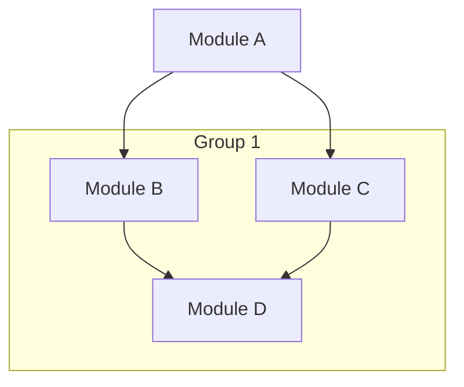
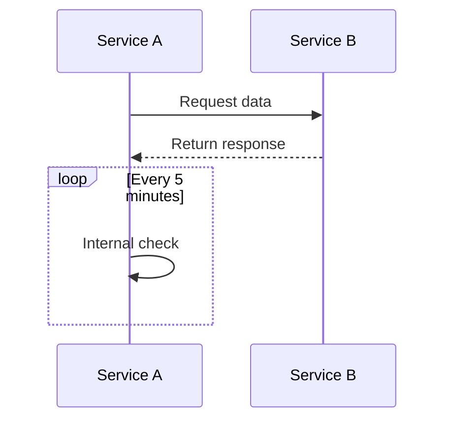
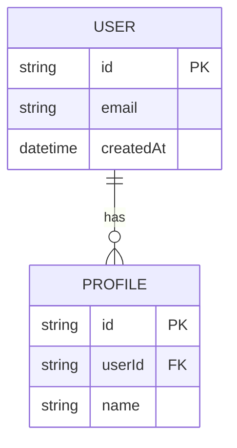

# Mermaid Diagram Style Guide

This document provides guidelines for creating and maintaining Mermaid diagrams throughout the project documentation. Following these standards ensures diagrams render consistently and correctly across different viewers.

## Table of Contents
- [General Rules](#general-rules)
- [Diagram Types and Examples](#diagram-types-and-examples)
- [Common Errors and How to Avoid Them](#common-errors-and-how-to-avoid-them)
- [Color Scheme](#color-scheme)
- [Testing Diagrams](#testing-diagrams)

## General Rules

1. **Syntax Format**
   - Begin each diagram with triple backticks followed by "mermaid"
   - End each diagram with triple backticks
   - Use proper indentation for readability

2. **Comments**
   - Always use `%%` for comments, never use `#`
   - Place comments on their own lines, not inline after connections
   - Example:
     ```
     %% This is a correct comment
     NodeA --> NodeB
     %% Another correct comment
     NodeB --> NodeC
     ```

3. **Node Definitions**
   - Define nodes before using them in relationships
   - Use consistent naming (camelCase or snake_case) within a diagram
   - Double-quote node text that contains spaces

4. **Relationships**
   - Keep relationship definitions simple and clear
   - Break complex flows into multiple diagrams if necessary
   - Add concise explanations after diagrams

## Diagram Types and Examples

### Flowchart (graph TD/LR)

For module dependencies, architecture diagrams, etc.



**Best Practices:**
- Use `TD` (top-down) for hierarchical structures
- Use `LR` (left-right) for process flows
- Use subgraphs to group related nodes
- Keep node labels concise

### Sequence Diagrams

For API request flows, authentication processes, etc.



**Best Practices:**
- Name participants clearly with "as" syntax
- Use proper arrow types (->>, -->, etc.) for semantic meaning
- Use notes, loops, and alt sections to clarify complex interactions

### Entity Relationship Diagrams

For database schemas, data models, etc.



**Best Practices:**
- Place each attribute on its own line
- Label primary keys as PK and foreign keys as FK
- Use proper cardinality notations
- Include meaningful relationship descriptions in quotes

## Common Errors and How to Avoid Them

1. **Inline Comments**
   - ❌ `NodeA --> NodeB # This comment breaks the diagram`
   - ✅ `NodeA --> NodeB`
   - ✅ `%% This is the correct way to comment`

2. **Multiple Attributes on One Line in ER Diagrams**
   - ❌ `string id PK string name`
   - ✅ `string id PK`
   - ✅ `string name`

3. **Missing Quotes for Text with Spaces**
   - ❌ `A[Core Module] --> B`
   - ✅ `A["Core Module"] --> B`

4. **Inconsistent Node References**
   - ❌ Define as `UserService` but reference as `user_service`
   - ✅ Use the same identifier consistently

5. **HTML Tags in Node Labels**
   - ❌ `A[Module <br/> Name]`
   - ✅ `A["Module<br/>Name"]` (only in specific contexts where HTML is supported)

6. **Cursor Position Markers**
   - ❌ Including `<CURRENT_CURSOR_POSITION>` or similar in diagrams
   - ✅ Remove all editor-specific markers

## Color Scheme

Use the following consistent color scheme for all diagrams:

### For Flowcharts

| Component Type | Fill | Stroke | Stroke Width | Text Color |
|----------------|------|--------|--------------|------------|
| Root/Main      | #f8d7da | #842029 | 2px | #842029 |
| Frontend       | #cff4fc | #055160 | 2px | #055160 |
| Backend        | #d1e7dd | #0a3622 | 2px | #0a3622 |
| Data Storage   | #e2e3e5 | #41464b | 2px | #41464b |
| External Service| #fff3cd | #664d03 | 1px | #664d03 |
| Core Module    | #cfe2ff | #0a3678 | 1px | #0a3678 |
| Feature Module | #d1e7dd | #0a3622 | 1px | #0a3622 |
| Configuration  | #fff3cd | #664d03 | 1px | #664d03 |

Example styling:
```
style AppModule fill:#f8d7da,stroke:#842029,stroke-width:2px,color:#842029
style UsersModule fill:#d1e7dd,stroke:#0a3622,stroke-width:1px,color:#0a3622
```

### For Sequence Diagrams

Use default styling with minimal customization unless specific highlighting is required.

### For ER Diagrams

Use default styling. Focus on clarity of relationships over styling.

## Testing Diagrams

Before committing diagrams:

1. Validate syntax using the [Mermaid Live Editor](https://mermaid.live/)
2. Check rendering in your local markdown viewer
3. Keep diagrams focused - split complex diagrams into multiple simpler ones
4. Ensure diagrams are accompanied by explanatory text

## Examples from Our Codebase

See `docs/architecture.md` for practical examples of all diagram types used in our system. 